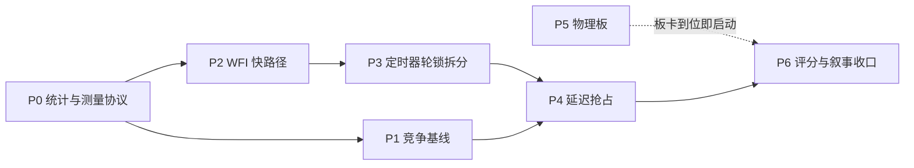

# Task1 实时分区第二阶段修复与实验计划

> 日期：2026-08-16
> 基线：`openrace/task1-rt-partition` 分支，`619ab6c6d`（含 24 小时复盘文档）
> 上游输入：[`24h-exploration-retrospective.md`](24h-exploration-retrospective.md) 第 8、13、14 节，以及本轮对其代码级核验的补充发现
> 定位：替代复盘文档第 14 节的"阶段 A-E"草案，作为下一阶段唯一执行依据

## 1. 诊断与目标重定义

第一阶段的机制实现质量已经过源码核验（no-tick、有界 vIRQ 队列、console 隔离、`IRQ_ROUTES` 死锁修复均属实且有回归覆盖），但端到端延迟只取得个位数百分比改善。本节先固定失败根因，再据此重定义第二阶段可以合法追求的目标，避免继续在一个数学上无解的比较框架里投入实验时间。

### 1.1 失败根因

失败不在执行，而在实验设计从未给"数量级改善"留出空间。三个根因彼此叠加，任何一个都足以把可观测效应压到与噪声同级。

| 根因 | 事实依据 | 后果 |
|---|---|---|
| 平台噪声地板过高 | native Zephyr 在 QEMU TCG 上均值已达 405.783 us（`native-zephyr/stats.txt`） | 被优化对象（hypervisor 开销约 259 us）只占总延迟 39% |
| 基线已经隔离 | `stress-noiso` 中 Zephyr 独占 pCPU1、Linux 固定 pCPU2/3，仅差 tick 与 profile 两个开关 | 可消除的干扰预算只剩约 51 us |
| 主路径机制未交付 | WFI 仍 trap（`wfi.rs` 保守策略）；抢占回退（`fifo.rs` 的 `set_priority` 返回 `false`） | 每周期必经的虚拟化控制路径原样保留 |

把三行合起来是一道算术题：基线 665 us、地板 406 us，即使把 AxVisor 开销降为零，可演示上限也只有均值 39%、P99 29%。同时同配置两次独立运行的均值差达 18.7%（614 vs 729 us），噪声大于任何单次可测效应。这决定了第二阶段的第一优先级不是继续优化，而是先换掉比较框架和统计方法。

### 1.2 可演示上界

第二阶段所有性能声明必须先通过"上界检查"：在开始一组实验前，用已有 native 与基线数据计算该比较框架下的最大可演示改善，若目标声明超过上界则调整框架而不是硬跑。这个纪律成本为零，却能避免重蹈第一阶段的覆辙。

| 比较框架 | 基线来源 | 上界（均值） | 能否支撑"数量级" |
|---|---|---:|---|
| `stress-noiso` vs `stress-rt`（现状） | 已隔离基线 | ≈39% | 不能 |
| 共核竞争 vs 完整 RT 分区（P1 新增） | 干扰任务占空比决定，毫秒级 | ≈3-12 倍 | 能，且诚实 |
| QEMU TCG vs 物理板（P5） | 硬件 native 抖动微秒级 | 相对差异放大一到两个数量级 | 能 |

### 1.3 新的结论主线

第二阶段的对外叙事从"我们把延迟优化了 X%"切换为"未分区时尾延迟受同驻负载摆布且无上界；RT 分区后延迟有界，且每一条隔离性质均可审计"。这条主线由三类证据支撑：P1 的竞争对比给出倍数级差距，P0 的统计协议让百分比结论可信，既有的 tick=0、队列有界、一小时无死锁证据说明有界性是机制保证而非运气。原目标中的"数量级优化"只在竞争对比和物理板两个框架下声明，其余场合一律用区间化的百分比表述。

## 2. 阶段路线与预算

第二阶段拆成 P0-P6 七个阶段。排序原则与复盘文档第 14 节的 A-E 草案有一处关键差异：竞争基线（P1）提到 WFI 快路径（P2）之前，因为它一天内可完成、直接产出本任务最缺的"数量级"证据，而 P2 需要多天开发且预期只有 10-25% 的增量。

### 2.1 阶段顺序与依赖

下图给出各阶段的依赖关系。P0 拆为两档：最小集（百分位汇总、容差定义、短跑重复规则）当天完成，直接服务 P1 快线；完整协议只在最终归档批次前需要。P1 的配置级快线只依赖 P0 最小集，是第一个出数字的节点；P2 的对外声明必须在 P0 协议下进行；P3 改动计时基础设施，放在 P2 的 A/B 归档之后以免污染对照环境；P4 依赖 P2/P3 稳定；P5 与主线并行，取决于板卡可用性；P6 贯穿始终、在每个阶段末更新。

P1 指向 P4 的边表示：抢占的可测量价值只有在共核场景存在后才能演示（独占核上除 vCPU 与 timer worker 外没有竞争者，抢占对现有四场景的数字影响为零），因此 P4 的验收实验复用 P1 的场景设施。

### 2.2 证据分层与预算

第一阶段的教训是把 30 分钟长跑当探索工具、并把测量预算花在算术上不可检出的效应上。第二阶段改为证据分层：实验时长与预期效应大小成反比，每升一级必须有上一级的通过证据；白天只跑分钟级实验，长跑一律过夜无人值守。TCG 上计数类证据（退出次数、tick 数、队列深度）无噪声且分钟级可得——第一阶段最可信的三个结论（tick 100/s 降为 0、WFI 约 140/s、overload 确定性 replay）全部属于这一类；端到端微秒类证据受 ±19% 运行间噪声支配，只在效应巨大或最终归档时使用。

| 层级 | 仪器 | 单次成本 | 适用 |
|---|---|---:|---|
| L0 计数不变量 | `vmexit stat`、tick 计数、队列深度 | 1-2 min | 二元判定，零噪声，机制验收首选 |
| L1 短窗侦察 | 120-300 Guest 秒单次运行 | 5-15 min | 判定效应量级：达 2 倍以上即升级确认；低于 20% 则判为 TCG 不可测，改用 L0 收口 |
| L2 统计协议 | 交错重复至少 5 次 | 过夜一批 | 仅限最终报告的旗舰对比，机制冻结后一次性执行 |

按分层重排后，白天在场成本压缩为每个决策点不超过 15 分钟的短跑；过夜无人值守批次控制在两个以内：一批是旗舰对比的 L2 重复（约 5-6 小时），另一批是新场景的 1800 秒归档长跑与长稳回归。第一阶段已归档的四场景矩阵与一小时稳定性数据不重跑，直接引用。

## 3. 统计与测量协议

本阶段不产生任何新机制，只把测量与统计基础设施修到"结论可信"的水平。为了不阻塞出数字，P0 拆成两档执行：最小集为 cyclictest 汇总补百分位、deadline 容差定义、短跑重复规则三项，当天完成，是 P1 快线数字进文档的唯一前提；其余项（构建溯源强制、trace 插桩、MMIO 归因）在最终归档批次前完成即可。对应改动集中在 `scripts/test/rt-partition/` 与 `scripts/test/rt_latency_stats.py`，全部有既有 Python 回归可扩展。

### 3.1 重复实验协议

单次运行相减得到的百分比在 ±18.7% 的运行间噪声面前没有意义，必须转为重复实验加区间表述。协议固定为：每个进入对比的场景至少 5 次独立运行，两个对比场景按 ABAB 交错顺序排队（消除时间漂移偏置），报告各场景的中位数与最小-最大区间。判定规则从严：仅当两场景的中位数差大于两侧区间的重叠范围（或 n≥5 时 Mann-Whitney U 检验 p<0.05）才允许在文档中写"改善"，否则写"未检出差异"。重复次数与效应大小挂钩：预期 2 倍以上的对比（如竞争基线）用 3 次 120-300 Guest 秒短跑即可让区间不重叠；低于 30% 的效应才需要 5 次以上 600 秒交错重复，且此类对比只保留给最终归档批次，不占白天时间。

runner 侧需要两个小改动：`run-cyclictest.sh` 增加 `--repeat N --interleave` 编排模式，输出按 `scenario/run-01 ... run-05` 组织并逐次生成独立 `meta.txt` 与 `sha256sums`；新增一个汇总脚本把多次运行折叠成中位数与区间表，作为文档引用的唯一来源。

### 3.2 采样与指标修正

Zephyr 侧当前每场景只有 300 个样本（`scripts/test/zephyr-periodic/src/main.c:10` 的 `SAMPLE_COUNT`），P99 等于第 3 差的样本、P99.9 恒等于 max，没有分辨率。同时 deadline 判定零容差（`scripts/test/rt_latency_stats.py:39` 中 `actual_ns > deadline_ns` 即计 miss），导致所有场景包括 native 都是 300/300 全丢，指标失去区分度且在答辩中有被误读为"全面失败"的风险。

1. `SAMPLE_COUNT` 提升到 3000（10 ms 周期即 30 秒窗口），长跑场景增加早/中/晚三个门控窗口，复用现有 `RT_START_GATED` 机制逐窗口触发。
2. `rt_latency_stats.py` 增加 `--tolerance-ns` 参数，同时输出零容差 miss（保留兼容）与容差 miss 两个字段，容差默认取周期的 10%（1 ms），并在 stats 文件里写明定义。
3. `cyclictest-summary.txt` 直接写入 P90/P95/P99/P99.9（从直方图 CSV 计算，与复盘文档补 T0.5 缺口的要求一致），杜绝"文档引用的数字在 summary 里找不到"的状态。

三项都必须先给现有 Python 测试（`test_cyclictest_hist_to_csv.py`、`test_rt_latency_stats` 相关用例）补上会在旧实现上失败的断言，再改实现，符合仓库回归先行的规范。

### 3.3 构建溯源与退出归因

第一阶段的正式二进制来自 dirty tree，`meta.txt` 虽记录了 `git_commit=a2b11542` 但无法证明二进制与该提交逐字节对应。第二阶段 runner 增加构建溯源检查：默认拒绝 dirty tree（`git status --porcelain` 非空即失败），显式传 `--allow-dirty` 才放行并在 `meta.txt` 标记 `dirty=true`；所有进入文档的运行必须 `dirty=false`。

退出归因补一个小实验闭环：第一阶段数据显示 Zephyr 窗口内 pCPU1 上 MMIO 是最大的退出类别（约 2644.5/s、增量 3.2 万次，远超 timer/WFI 的 1707 次），推测来自采样结束后 300 行 CSV 经模拟 UART 逐字符输出，但未验证。改动为在 `PERIODIC LATENCY COMPLETE` 打印之后、CSV 转储之前额外采一次 `vmexit stat` 快照，把"采样窗口内退出"与"结果转储退出"分开归档，使 VM-exit 证据表可以精确解释每一类退出的来源。

### 3.4 阶段延迟追踪

复盘文档承认正式运行全部 `realtime_trace=disabled`，关键路径分析停留在退出计数层面。第二阶段安排一组独立的 trace-enabled 运行（不与正式对比矩阵混用，因为插桩本身有开销）：启用 `realtime-trace` feature（`virtualization/axvm/src/runtime/mod.rs:33` 已门控 `VirqTraceRing`），记录中断源触发、入队、通知、LR 注入、Guest ISR 各阶段时间戳，产出每阶段 P50/P90/P99 分布。这组数据服务两个目的：为 P2 的 WFI 快路径提供改造前的路径耗时分解，以及支撑评分点"目标与关键路径分析"从 3/4 提升到 4/4。

## 4. 竞争基线场景

本阶段制造第一阶段始终缺失的"真正未分区"对照：让 Zephyr 与一个受控竞争者共享 pCPU1。这是整个计划的重心与第一个交付物——按第 2.2 节的分层协议，它的预期效应在倍数级，用 L1 短跑即可看见，目标是**当天出第一个数字**。它同时是"数量级"叙事唯一诚实的来源，直接对应评分表"改造前后数据"与"idle 与 stress 对比"两项的主要缺口。

### 4.1 场景设计

新增场景 `stress-shared`：Zephyr vCPU 仍绑定 pCPU1，但不设置 `dedicated_cpus`，timer profile 保持 virtualized；竞争者有两条实现路线——路线一把 Linux 的负载 vCPU 直接放到 pCPU1 上（真实的 Guest 对 Guest 共核），路线二在 host 侧派生一个绑定 pCPU1 的干扰任务（参数完全受控）。两条路线的 Linux 测量核配置均与 `stress-noiso` 一致，保证唯一变量是 pCPU1 上是否存在竞争者。

无论哪条路线，竞争者都必须是"忙 N 毫秒、睡 M 毫秒"的占空比模型而不能是 100% 忙循环，原因是硬约束：当前调度器是协作式 FIFO（`components/axsched/src/fifo.rs:65` 的 `set_priority` 返回 `false`，`task_tick` 也返回 `false`），永不让核的同核竞争者会把 Zephyr vCPU 无限饿死，实验直接挂起。占空比同时具备语义合理性——它模拟"与 RT 负载同驻的突发性杂务"，正是分区技术要防御的现实场景；而"Zephyr 的唤醒被推迟到竞争者忙段结束"这一现象本身，就是无抢占加共核的真实危害展示，也为 P4 的抢占交付提供动机场景。

### 4.2 配置级快线

路线一是首选，因为它不写任何 Rust 代码：在 `stress-shared` 的生成配置里把 Linux 负载 vCPU 的放置从 pCPU2 改到 pCPU1（第一阶段已交付的 vMPIDR 与物理放置解耦使任意放置成为可能，`vm.rs:52` 起），Guest 内负载改用 `stress-ng` 的占空比模式（`--cpu-load` 配合 `--cpu-load-slice`），使 Linux 在闲段进入 idle 并执行 WFI——vCPU 任务随之停车，FIFO 把核让给 Zephyr；忙段则占住核，Zephyr 的定时器唤醒被推迟到忙段结束。改动只落在 `run-cyclictest.sh` 的场景生成与 `rt-linux-init.sh` 的负载命令，加一次镜像重建。

执行顺序有一个前置验证与一组参数目标。首步验证静态 `stress-ng` 构建（`build-rt-tools.sh` 产物）支持占空比选项，不支持则退回向 initramfs 加一个几十行的忙睡交替小工具；参数目标为两档忙窗——约 10 ms 与约 50 ms（负载率固定 50%），具体旗标以实测为准。跑两档而不是一档，是为了展示"Zephyr 尾延迟随竞争者忙窗线性增长"的趋势线，抵御"参数是挑出来的"质疑。

### 4.3 受控干扰变体

路线二作为后续补充：host 侧按 bootargs 旗标 `rt_burner=<cpu>:<busy_ms>:<idle_ms>` 派生干扰任务，忙段读时钟自旋，闲段必须阻塞睡眠而非 yield 自旋（否则 FIFO 下仍占核），cpumask 绑定复用 `timer.rs:371` 中 timer worker 的绑核方式。它的价值在于参数毫秒级精确可控、不受 Guest 内调度影响，适合做正式归档时的干扰强度扫描，并在 P4 阶段复用为"低优先级同核干扰下证明唤醒到运行有界"的标准负载。

| 改动 | 位置 | 说明 |
|---|---|---|
| 干扰任务派生 | `os/axvisor` 启动路径 | 解析 `rt_burner` 旗标并派生绑核任务 |
| 场景接线 | `scripts/test/rt-partition/run-cyclictest.sh` | 生成配置时不写 `dedicated_cpus`，追加 burner 旗标 |
| 防饿死看门狗 | runner 既有 progress watchdog | Zephyr 窗口超时即判失败并采证 |

路线二不阻塞出数字：只要路线一的短跑已经给出倍数级差距，路线二可以推迟到正式归档批次之前实现。

### 4.4 预期结果与验收

预期按几何模型预登记（唤醒时刻均匀落入忙/闲窗口）：50% 负载、忙窗 W 毫秒时，约半数唤醒被推迟平均 W/2，P99 逼近 W。忙窗 10 ms 档预期 Zephyr P99 约 10 ms，对比 `stress-rt` 的 0.810 ms 约 12 倍；忙窗 50 ms 档 P99 约 50 ms，对比约 60 倍。预期是预登记而非承诺，实测偏离本身也是有效结论（例如 Guest 内 WFI 触发时机与忙窗边界的相位关系可能压低尾部）。

验收按分层协议执行：L1 层每档忙窗 3 次 120-300 Guest 秒短跑，全部完成且无饿死（看门狗不触发），`stress-shared` 与 `stress-rt` 的中位数区间无重叠；归档层在机制冻结后按 P0 完整协议补一批过夜运行进正式证据目录。文档措辞固定为"分区把同核竞争下无上界的唤醒延迟压回有界的亚毫秒级"，倍数只作为该表述的量化注脚。

## 5. WFI 快路径

本阶段交付第一阶段回退清单中唯一直接作用于每周期必经路径的机制：dedicated Zephyr 在所有实际暴露的 Guest 定时器都具备硬件唤醒能力时不再陷入 WFI，消除"WFI trap → 软件定时器轮 → 任务停车 → worker 唤醒 → FIFO 重调度"整段软件等待路径。预期收益为均值 50-150 us（即 10-25%），预期必须按此口径向外沟通，不得暗示数量级。

### 5.1 能力模型改造

当前 `TIMER_WAKE_CAPABILITIES` 是编译期常量（`virtualization/axvm/src/arch/aarch64/wfi.rs:12`，`virtual_timer=true, physical_timer=false`），而 `trap_wfi` 在 `vm.rs:80` 以该常量对所有 VM 一刀切。改造方向是把能力判断变为数据驱动：`vm.rs:69` 处 `attach_vcpu` 已经按 VM 传递 `timer_profile`，从该 profile 推导"本 Guest 实际暴露的定时器集合"，`trap_wfi` 的判据改写为"每一个暴露的定时器都能硬件唤醒"，而不是全局的两个布尔。这样 Linux（仍暴露 CNTP）自动保持 trap，RT Zephyr（收窄后只暴露 CNTV）自动获得免陷入，互不影响。

`wfi.rs` 现有三个策略单测按新签名改写并扩展：新增"profile 只含 CNTV 且 dedicated 则不 trap"、"profile 含 CNTP 则无条件 trap"两条，先写断言验证旧实现失败，再改实现。

### 5.2 客户机定时器收窄

RT Zephyr 的 Guest FDT 改为只暴露虚拟定时器中断（CNTV PPI），移除物理定时器项。第一阶段的观测证据（Zephyr 窗口内 pCPU1 的 `sysreg` 与 `nothing` 退出均为 0）支持 Zephyr 从不触碰 CNTP，但观测不等于契约——收窄 FDT 把它变成结构保证：Guest 根本看不到不能硬件唤醒的定时器，5.1 的能力推导才有可靠输入。改动落在 `virtualization/axvm/src/boot/fdt/core/` 的 FDT 生成路径与 `rt-partition-zephyr.toml` 的 profile 声明，需配一条"RT profile 的 FDT 不含物理定时器节点"的构建期回归。

### 5.3 唤醒源验证与回退

免陷入 WFI 意味着物理核真正停在 Guest 的 WFI 指令上，所有需要"把 Guest 拽出来"的路径都必须验证仍然有效。清 TWI 后，路由到 EL2 的物理中断（HCR 的 IMO 位）依然会唤醒物理核并陷入 host，因此机制上可行，但每条路径都要有显式测试。

1. 远程 vIRQ 注入：另一核向该 vCPU 投递中断时，host IPI 必须能把核从硬件 WFI 中唤醒并完成注入，覆盖 `dispatcher.rs` 的入队加 kick 路径。
2. VM 停止与暂停：`stop_vm`/`pause` 不能再依赖 vCPU 任务在 host 侧停车点检查标志，必须经 IPI 强制退出；与 `e3570a607` 已交付的 CPU enable 超时 fail-closed 逻辑联测。
3. Console 输入：pCPU0 housekeeping 收到输入后对 pCPU1 的通知链路必须端到端可达。

验收为三层：单测层（新策略测试全绿）；机制层（30 分钟 `stress-rt` 中 `vmexit stat` 显示 pCPU1 的 WFI 与 timer 退出从约 140/s 降到接近 0，且无丢唤醒、无停止挂起）；端到端层（按 P0 协议做免陷入前后 A/B，差值需超出区间重叠才声明改善）。回退方案是保留 profile 级开关强制 trap，默认保守，全部验收通过后才切换默认值。

## 6. 定时器轮锁拆分

本阶段消除最后一处已识别的跨分区耦合：`virtualization/axvm/src/timer.rs:222` 的 `TIMER_WHEELS` 虽然数据已按 CPU 分桶（`BTreeMap<usize, TimerList>`），但整个结构在单一 `IrqSafeMutex` 之后，Linux vCPU 与 Zephyr vCPU 的定时器注册、取消、到期仍争同一把关中断锁。P2 完成后该锁在 RT 核上的使用频率大幅下降，但 Linux 侧高频定时器活动仍可能在持锁期间推迟 RT 核的中断处理。

### 6.1 拆分方案

把 `TimerWheels` 拆为按 CPU 索引的独立"轮加锁"单元（既有 `MAX_RT_STATS_CPUS=8` 的 per-CPU 统计数组可作布局参照）。跨核语义的难点比复盘文档估计的小：`VmTimerHandle` 本身已携带 `owner_cpu`（`timer.rs:100`），基于句柄的取消可以直接定位到目标 CPU 的锁；真正依赖全局 `owners` 映射的只有按裸 token 取消的旧路径（`timer.rs:264` 的 `cancel_timer`），先把调用方迁移到句柄接口，再删除全局映射。`PublishedTimerDeadline` 的无锁发布通道（`timer.rs:54`）保持不变，IRQ 读路径不受拆分影响。

拆分同时处理一个未被复盘记录的延迟源：`IrqSafeMutex` 持锁期间 `TimerList` 插入可能触发堆分配，即关中断状态下分配内存。方案为轮结构预分配容量，或至少在拆分后测量并记录该路径的最坏持锁时长。

### 6.2 验收标准

功能层面，现有的跨核取消与重编程测试（`remote_cancel_reprograms_owner_cpu_timer`、`owner_aware_handle_rejects_a_stale_cpu_identity` 等）必须全绿，另补"两核并发注册取消互不阻塞"的新回归。性能层面，用 3.4 的 trace 通道验证：Linux 侧制造定时器风暴时，pCPU1 的轮操作持锁等待不随之增长。该验收显式对应复盘文档第 13 节"全局 TIMER_WHEELS mutex"未解决项的关闭条件。

## 7. 延迟抢占与优先级调度

本阶段兑现原始任务中"就绪即抢占"的承诺。它排在最后不是因为不重要，而是因为它对现有独占核场景的数字影响为零（核上只有 vCPU 与 timer worker，两者的唤醒链在协作式 FIFO 下已是即时的），其可测量价值依赖 P1 的共核场景；同时它是第一阶段两次崩溃（world switch 中 EL2 data abort、dedicated 加 SMP4 启动卡 50%）的高风险区，必须放在稳定基线之上做。

### 7.1 临界区设计

崩溃根因是中断尾部的任务切换撕裂了进行中的 vCPU 世界切换状态。修复设计沿用复盘文档阶段 E 的框架并具体化：定义 per-CPU 的 vCPU 上下文临界区，范围从 VGIC 状态装载起、到状态保存与 deferred IRQ token 处理完成止；临界区内发生的高优先级就绪只设置 need-resched 标志，不做任务切换；切换只发生在 vCPU 运行循环的稳定边界（进 Guest 前、出 Guest 后 deferred 工作完成时、停车前）。每个边界点配一条"临界区内触发抢占请求不立即切换"的回归。

### 7.2 调度器与远程唤醒

调度器从 `FifoScheduler` 替换为固定优先级类加类内 FIFO 的实现（`components/axsched/` 内新增，不动既有 FIFO 以保护其他使用方），`set_priority` 真正生效，使 `RT_TASK_PRIORITY=90`（`runtime/vcpus.rs:40`）从意图标注变为行为。远程唤醒 IPI 的接入前置条件是先根治 dedicated 加 SMP4 的启动竞态：按复盘定位做 wake-before-wait 修复，并把"次核 4/4 启动"做成确定性回归，之后才允许 IPI 参与重调度。

### 7.3 组合验收矩阵

抢占、IPI、dedicated 三个机制两两组合曾各自出过事故，验收必须覆盖全组合而不是只测最终形态。矩阵为 {抢占开/关} x {IPI 开/关} x {dedicated 开/关} 在 SMP4 下全部通过启动与 30 分钟双 Guest 冒烟；性能验收复用 P1 场景：在低优先级同核干扰任务存在时，测量 vCPU 从就绪到运行的延迟分布并证明其有界，这就是"就绪即抢占"从代码承诺变成一张可展示曲线的时刻。

## 8. 物理板迁移

QEMU TCG 的约 400 us 噪声地板与约 300 ms 的宿主机调度离群点，决定了软件在环数据永远只能作相对趋势证据。物理板是让"硬实时"三个字成立、让所有机制以真实量级显现的唯一途径，也是评分表中 native 基线与全部性能证据可信度的最后一档提升。

### 8.1 前置条件

复盘文档把物理板列为外部阻塞，但仓库内已存在完整的 OrangePi-5-Plus 板级工作流（`board connect` 租约、SSH/rsync 部署、U-Boot 介入与 rootfs 修复的项目 skill 均已就位），说明该型号板卡在项目环境中曾经可用。第一动作是确认板卡租约可得性；若确认不可得，本阶段整体挂起并在文档中保持"外部阻塞"状态，不影响 P0-P4 推进。

### 8.2 复跑矩阵

板卡到位后的顺序是：先跑 native Zephyr 基线（预期抖动微秒到几十微秒级，直接替换 406 us 的 TCG 地板），再移植 AxVisor 双 Guest 拓扑（走 someboot 启动链，SPI 与串口分配需按板卡重排 `allocation-table.md`），最后复跑 P0 协议下的核心对比：竞争基线、`stress-rt`、WFI 免陷入前后。硬件上 host tick、WFI 陷入这些几十微秒级机制将以显著的相对差异显现，max 值也第一次具备"实测上界"的解释力，但措辞仍不声称形式化 WCET。

## 9. 评分与叙事收口

本阶段贯穿 P0-P5，负责把每一步产出即时折算为评分增量与合规措辞，避免第一阶段"先跑完再发现口径不能用"的返工。收口以复盘文档第 11 节的保守自评 19-22/30 为起点，目标区间 26-28/30。

### 9.1 措辞规范

所有对外文档执行三条硬规则。第一，单次运行差值一律标注"单次观察值"，可声明的改善只来自 P0 协议下的区间化结论；第二，"数量级"仅出现在竞争对比（P1）与物理板（P5）两个框架的表述中；第三，`deadline_misses` 在所有出现处附带定义说明（零容差与容差两个口径），杜绝"全部错过截止时间"的误读。复盘文档第 15 节的"可以与不可以声称"清单随各阶段验收逐条迁移状态，每次迁移引用具体证据路径。

### 9.2 评分映射

各阶段对评分点的预期贡献如下表，用于在时间压力下裁剪范围时判断优先级：若必须砍，先砍 P3（正确性收益为主、直接分值最低），最后砍 P1 与 P0（它们承载最大的分值缺口）。

| 评分点 | 现状自评 | 提升来源 | 目标 |
|---|---:|---|---:|
| 目标与关键路径分析 | 3/4 | P0 阶段延迟追踪给出各阶段分布 | 4/4 |
| 关键机制实质改造 | 4-5/8 | P2 免陷入 WFI、P3 锁拆分、P4 抢占 | 6-7/8 |
| 多核 Linux 配置合理 | 4/4 | 维持 | 4/4 |
| 改造前后数据与最坏情况 | 2/5 | P0 统计协议、P1 竞争对比、P2 前后 A/B | 4/5 |
| idle 与 stress 对比 | 2-3/4 | P1 补齐共核竞争一档、P0 重复实验 | 4/4 |
| RTOS native 基线可复现 | 4/5 | P5 物理板 native | 5/5 |

按表汇总，P0 加 P1 两个低风险阶段完成后即可到约 23-24 分，P2 验收通过后进入 26 分区间，P4 与 P5 决定能否触及 28。评分映射每阶段验收后回填实际值，偏差超过一分时回到 1.2 的上界检查重新校准预期。
